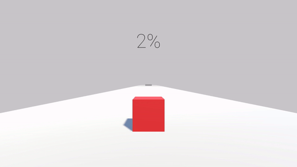

# Cube Slide

A simple platformer game where you slide a cube around to reach the goal. Made with Godot Engine.



## Web Export

Create a web build with the Godot CLI:

```sh
godot --headless --export-release "Web" build/web/index.html
```

The output will be placed in build/web/.

## Preview Locally

Serve the exported site (with proper CORS headers) to test in a browser:

```sh
python3 serve.py --root build/web
```

Defaults to http://127.0.0.1:8060. Useful options:
- `--no-browser` — don't auto-open the page  
- `--port <N>` — choose a different port

If you see CORS or MIME errors, check the server script and clear the browser cache.
